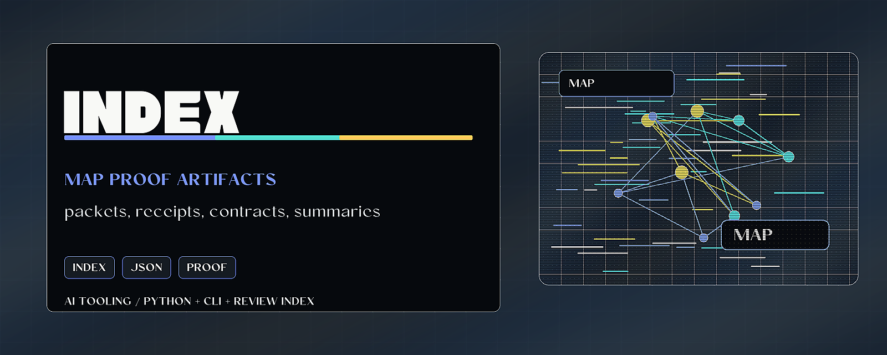

# Repo Proof Index



> Build a reviewer-ready index over proof packets, receipts, and contracts.

Repo Proof Index scans proof artifacts and returns the compact view a maintainer
needs before release review: kind, surface, status, evidence summary, and source
path. It indexes evidence; it does not decide whether the evidence is enough.

## Why it matters

As a repo gains receipts and proof packets, reviewers need a fast way to find
what each artifact claims and where the evidence lives. This tool makes that
proof layer navigable.

## Try it

```bash
python -m pip install -e ".[test]"
repo-proof-index examples/contracts/*.json --summary
python -m pytest
```

## What to test first

- Index the bundled example contracts.
- Run `repo-proof-index --root .` in a repo with proof artifacts.
- Use `--validate` on a proof-surface packet.

## Current status

Python package and CLI with tolerant JSON parsing and proof-surface integration.
It produces review indexes and summaries, not compliance findings.

## Existing technical notes

> Reviewer-ready index over proof packets and receipts — indexes the evidence; does not decide if it is enough.

[](LICENSE)


[](https://github.com/HarperZ9/repo-proof-index/actions/workflows/ci.yml)
[](https://harperz9.github.io)

`repo-proof-index` turns scattered proof artifacts into a reviewer-readable
index. Feed it JSON proof contracts, proof-surface packets, witness receipts,
and backend descriptors; it returns the compact view a maintainer needs before
a release-readiness or diligence handoff.

The parser is intentionally schema-tolerant. Unknown contract shapes still get
best-effort identifiers, status, surface, evidence, and source path fields.

Use it when a repo or workspace has proof artifacts but no quick way to see
what they claim, what surface they describe, what status they report, and where
the evidence lives.

## Install

```bash
python -m pip install repo-proof-index
```

For local development:

```bash
python -m pip install -e ".[test]"
python -m pytest
```

## Usage

See [USAGE.md](USAGE.md) for a full usage guide with worked examples and
expected output. A quick tour follows.

Index explicit JSON files:

```bash
repo-proof-index contracts/*.json
repo-proof-index contracts/*.json --json
repo-proof-index contracts/*.json --summary
repo-proof-index contracts/*.json --summary --json
repo-proof-index --validate examples/contracts/proof-surface-packet.json
repo-proof-index --validate examples/contracts/proof-surface-packet.json --json
```

Index the common workspace location:

```bash
repo-proof-index --root .
```

Use a custom contracts directory:

```bash
repo-proof-index --contracts-dir project-docs/contracts
```

Run the bundled quick demo:

```bash
repo-proof-index examples/contracts/*.json
```

Malformed input example:

```bash
repo-proof-index examples/malformed/not-object.json
```

Expected behavior: the command prints an `error:` line and exits with status
`1` instead of producing a proof row.

## What it indexes

Known shapes:

- proof-surface interop packets with `proof_surface_version` and `packet_id`
- ORCA organ exchange artifacts from `orca.module.organ_exchange.bundle`
- proof-surface organ receipt bundles with `organ_bundle_version` and `bundle_id`
- product use-case manifests with `manifest_id` and `product`
- backend capability descriptors with `descriptor_id` and `backends`
- witness receipts with `receipt_id` and `verdict`
- generic JSON contracts with common fields such as `id`, `report_id`,
  `manifest_id`, `descriptor_id`, `status`, `maturity`, `verdict`, `claims`,
  `verification`, and `notes`

Default discovery path when explicit files are omitted:

```text
project-docs/roadmaps/contracts/*.json
```

## Output fields

| Field | Meaning |
| --- | --- |
| `kind` | Best-effort contract type. |
| `surface` | Product, language, witness implementation, root, or contract name. |
| `status` | Status, maturity, verdict, or fallback status. |
| `evidence` | Short evidence summary from verification, claims, notes, or backend counts. |
| `path` | Source JSON path in JSON mode. |

## Release summary mode

Use `--summary` when a reviewer needs the portfolio-level signal instead of
row-by-row detail. The summary reports total artifacts, kind counts, status
counts, evidence-gap count, and the first actionable rows that need stronger
proof.

Running it over the bundled example contracts:

```bash
repo-proof-index examples/contracts/*.json --summary
```

```text
total: 4
kinds: backend-capability=1, product-use-case=1, proof-surface-packet=1, witness-receipt=1
statuses: MATCH=1, backend-matrix=1, needs-polish=1, release-candidate=1
evidence_gaps: 0
action_items:
- proof-surface-public-release-demo: resolve needs-polish (examples/contracts/proof-surface-packet.json)
```

## Example table output

```text
kind                   | surface                | status             | evidence
---------------------- | ---------------------- | ------------------ | ------------------------------------------------------------------------
product-use-case       | sample-tool            | release-candidate  | pass: example tests passed
witness-receipt        | sample-witness         | MATCH              | sample receipt available
backend-capability     | rust                   | backend-matrix     | pass=1, planned=1
```

## Example JSON output

```json
[
  {
    "contract": "product-usecase-quanta-ui",
    "kind": "product-use-case",
    "surface": "quanta-ui",
    "status": "private-gated",
    "evidence": "pass: 17 tests passed",
    "path": "contracts/quanta-ui.json"
  }
]
```

## What it does not do

- It does not validate a JSON Schema.
- It does not certify that evidence is sufficient.
- It does not read private payloads referenced by a contract.
- It does not decide whether a claim is true.
- It does not replace tests, audits, or release review.

## Release-readiness use

`repo-proof-index` is the evidence assembly point in a proof-surface pipeline:

```text
contracts and receipts -> proof index -> report -> reviewer handoff
```

Its job is to make proof artifacts visible enough for a maintainer, reviewer,
client, or employer to see what exists and what still needs a stronger gate.

## Proof-surface interop packet

The `schemas/proof-surface-packet.schema.json` file defines a small shared
packet for release-readiness evidence. It is intentionally neutral: independent
tools can publish claims, checks, and action items without asking any one tool to
become the authority.

```text
surface claim -> evidence pointer -> check result -> action item
```

`repo-proof-index` recognizes these packets as `proof-surface-packet` rows and
summarizes their claim, check, and action counts. See
`examples/contracts/proof-surface-packet.json` and
`docs/PROOF-SURFACE-INTEROP.md`.
The current version and known producer/consumer registry lives at
`docs/PROOF-SURFACE-REGISTRY.json`.

Validate packet shape locally:

```bash
repo-proof-index --validate examples/contracts/proof-surface-packet.json
```

The validator is intentionally strict for the v0.1 contract: unexpected root,
claim, or check fields are reported as errors instead of silently drifting the
interop shape.

Export the portable contract bundle:

```bash
python scripts/export_proof_surface_contract.py --out dist/proof-surface-contract-v0.1
```

## Research harness

The draft research harness scores proof-surface cases across schema validity,
evidence coverage, actionability, non-authority language, and witness/provenance
presence.

```bash
python scripts/score_proof_surface_research.py
```

See `docs/PROOF-SURFACE-RESEARCH-HARNESS-v0.1.md`.
Case contribution guidance lives at
`docs/PROOF-SURFACE-CASE-CONTRIBUTING.md`.

---
**Zain Dana Harper** — small tools with explicit edges.
[Portfolio](https://harperz9.github.io) · [HarperZ9](https://github.com/HarperZ9)
<sub>Built with Claude Code; reviewed, tested, and owned by me.</sub>

## For developers

Keep the public README, package metadata, and examples aligned with current behavior. Before opening a PR or pushing a release, run the local package verification path.

```bash
python -m pip install -e ".[test]"
python -m pytest
```
